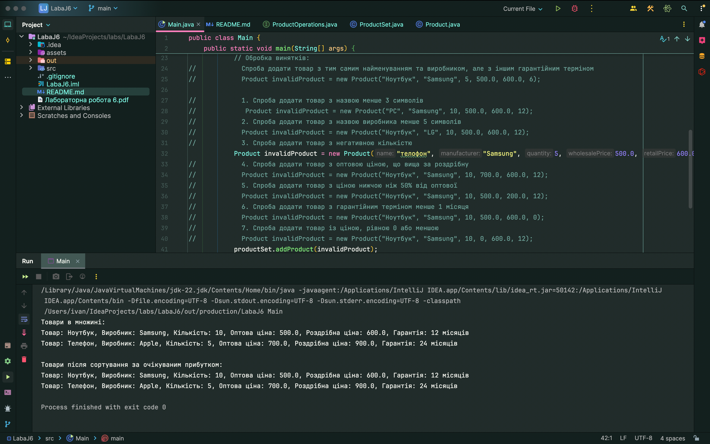

# Лабораторна робота № 6 Обробки виняткових ситуацій

## Мета лабораторної роботи –
Придбання навичок в виявленні і обробці виняткових ситуацій.

## Вхідні дані до лабораторної роботи:
Створити клас «Множина товарів». Кожен товар характеризується:
- найменуванням товару,
- назвою виробника,
- кількістю (в одиницях),
- оптовою ціною, - роздрібною ціною,
- гарантійним строком.
  Елементи множини розрізняються по найменуванню товару та найменуванню
  виробника.
  Список методів, які можуть бути реалізовані в класі.
1. Додавання товару.
2. Виведення множини товарів на екран.
3. Объеднання множин (підсумовування кількості, усереднення роздрібної ціни).
4. 54. Відсортувати елементи множини за спаданням очікуваного прибутку.

Список рекомендованих виняткових ситуацій для реалізації в програмі
1. Ділення на 0.
2. Вихід за межі масиву.
3. Помилка, пов'язана з невідповідністю типів даних.
4. Спроба додати товар з існуючим найменуванням і виробником, але з новим
   гарантійним строком.
5. Оптова ціна виявилася вище роздрібної.
6. Негативна кількість товару.
7. Ціна менше нуля або дорівнює нулю.
8. Найменування товару містить менше 3 символів.
9. Найменування виробника містить менше 5 символів.
10. Не можна знизити ціну товару більш ніж на 0.5 від оптової ціни.
11. Гарантійний термін менше 1 місяця.
    
**Індивідуальні завдання.**

Студент вибирає варіант завдання згідно зі своїм номером у списку групи з наведеної
    нижче таблиці 3. У таблиці для кожного варіанту визначений набір методів об'єкта з
    наведеної вище списку методів.
    При складанні програми необхідно передбачити обробку, як мінімум, двох
    виняткових ситуацій з наведеного вище списку. Таблиця 3. Варіанти завдань

## Висновок: 
на даній лабораторній роботі придбав навички в виявленні і обробці виняткових ситуацій.

**З таким вмістом в Main:**
```java
public class Main {
    public static void main(String[] args) {
        try {
            ProductSet productSet = new ProductSet();

            // Створюємо продукти
            Product product1 = new Product("Ноутбук", "Samsung", 10, 500.0, 600.0, 12);
            Product product2 = new Product("Телефон", "Apple", 5, 700.0, 900.0, 24);

            // Додаємо продукти в множину
            productSet.addProduct(product1);
            productSet.addProduct(product2);

            // Виведення товарів
            System.out.println("Товари в множині:");
            productSet.printProducts();

            // Сортування за очікуваним прибутком
            productSet.sortByExpectedProfit();
            System.out.println("\nТовари після сортування за очікуваним прибутком:");
            productSet.printProducts();

            // Обробка винятків:
//            Спроба додати товар з тим самим найменуванням та виробником, але з іншим гарантійним терміном
//            Product invalidProduct = new Product("Ноутбук", "Samsung", 5, 500.0, 600.0, 6);

//            1. Спроба додати товар з назвою менше 3 символів
//             Product invalidProduct = new Product("PC", "Samsung", 10, 500.0, 600.0, 12);
//            2. Спроба додати товар з назвою виробника менше 5 символів
//            Product invalidProduct = new Product("Ноутбук", "LG", 10, 500.0, 600.0, 12);
//            3. Спроба додати товар з негативною кількістю
            Product invalidProduct = new Product("телофон", "Samsung", 5, 500.0, 600.0, 12);
//            4. Спроба додати товар з оптовою ціною, що вища за роздрібну
//            Product invalidProduct = new Product("Ноутбук", "Samsung", 10, 700.0, 600.0, 12);
//            5. Спроба додати товар з ціною нижчою ніж 50% від оптової
//            Product invalidProduct = new Product("Ноутбук", "Samsung", 10, 500.0, 200.0, 12);
//            6. Спроба додати товар з гарантійним терміном менше 1 місяця
//            Product invalidProduct = new Product("Ноутбук", "Samsung", 10, 500.0, 600.0, 0);
//            7. Спроба додати товар із ціною, рівною 0 або меншою
//            Product invalidProduct = new Product("Ноутбук", "Samsung", 10, 0, 600.0, 12);
            productSet.addProduct(invalidProduct);

        } catch (Exception e) {
            System.out.println("Помилка: " + e.getMessage());
        }
    }
}

```

**Результат:**



Лінк на [ГуглДокумент звіту](https://docs.google.com/document/d/1TJyaA1yzRoAWFo83TZLXpit8FUjj4ueFHZWIPOfvol8/edit?usp=sharing).